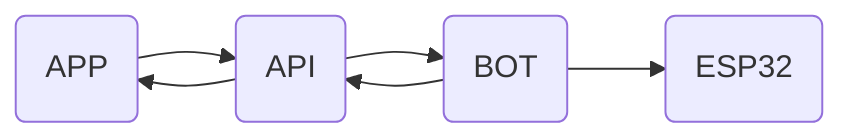
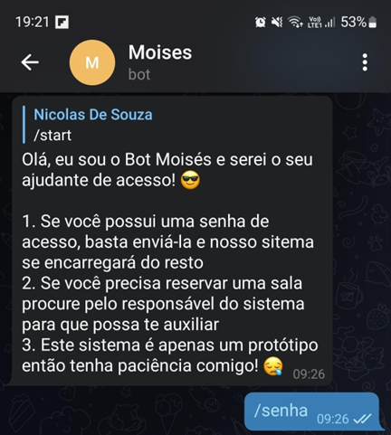

# Bot Moisés

> Projeto desenvolvido como Trabalho de Conclusão de Curso (TCC) para o curso de Engenharia de Controle e Automação e apresentado em outubro de 2022
> 

## Overview do projeto Moisés

## Objetivo

<aside>
✅ Criar uma interface amigável ao usuário que possibilite controlar a fechadura do sistema

</aside>

## Resultados e Discussões

O bot interage de maneira simples com o usuário, não sendo necessário um grande conhecimento tecnológico ou maiores intimidades com a ferramenta, basta tão somente saber digitar.

Como o objetivo aqui era construir um modelo razoavelmente maduro para simulações, o bot é bem simples e não possui grandes refinamentos, mas cumpre de maneira satisfatória o seu papel no sistema.

Bot: mensagens informativas

Bot: envio de mensagens

## Implementações Futuras

- Criação de arquivos de configuração
- Adição de comandos do tipo markup comuns em outros bots Telegram
